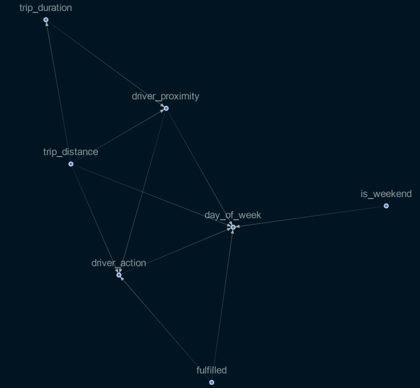

# gokada-delivery-optimisation-with-casual-inference
<p align="center">
     
</p>

## Overview
Our client for this project is a delivery company. The company works in partnered with motorbike owners and drivers to deliver parcels across Lagos, Nigeria. This company has an issue of high number of unfulfilled delivery requests. The cause of this problem is the sub-optimal placement of pilots and clients who wants to sent their parcel.

In this project we are supposed to work on the data to help the company understand the primary causes of unfulfilled requests as well as come up with solutions that recommend drivers locations that increase the fraction of complete orders. Since drivers are paid based on the number of requests they accept, your solution will help the company business grow both in terms of client satisfaction and increased business.

## Objective
We will try to answer some interesting question that cannot be answered by just analyzing observational data alone.

#### These questions can be similar to:

• Given drivers are recommended to move 1km every 30 mins in a selected direction, what happens to the number of unfulfilled requests?

• If we assume we know the location of the next 20% of orders within 5km accuracy, what happens to the number of unfulfilled requests?

• Had we changed the time requirements to drivers operating time in the past, what fractions of orders could have been completed?

• If I increased the number of drivers by 10% cumulative per month, what fraction of orders can be completed?

## Installation guide

```
git clone  https://github.com/nahomHmichael/gokada-delivery-optimisation-with-causal-inference.git
pip install -r requirements.txt
```


